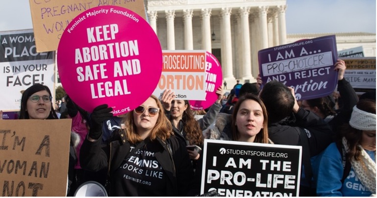

# Pro-Choice vs. Pro-Life: Tweets Exploratory Data Analysis

### To see a scientific format of paper, please open the scientific_format_paper.docx in the GitHub. 

# Introduction

The 1973 Roe vs. Wade decision, legalizing abortion in all fifty states, seems to solve one of the most controversial issues in terms of abortion. However, on June 24, 2022, the Supreme Court issued a bill to prohibits a person's ability to access out-of-state abortion services and ban abortions after 15 weeks of pregnancy nationwide, which is overturning Roe v. Wade case.

The Congress's decision has drawn a lot of attention on social media, especially for female aspect. The argument divides into two opinions: Pro-Choice vs. Pro-Life. People who support pro-choice believe that everyone has the basic human right to decide when and whether to have children, which means they think it is OK for them to have the ability to choose abortion as an option for an unplanned pregnancy – even if you wouldn't choose abortion for yourself.

People who support pro-life believe that the life of the fertilized egg, embryo, or fetus is much important than the welfare of children after they are born and oppose child welfare legislation. The controversial issues pit people against each other, as if they are on two different teams. Most Americans believe abortion should be legal because it is human rights to access abortion.

In this paper, I will do an exploratory data analysis on tweets about pro-choice vs. pro-life due to the Roe vs. Wade cancellation sentence. It is to be used for review for people want to have a general idea about how people reaction to the bill that ban abortion in certain states, especially for female. The neural network model helps them to grasp pragmatic understanding of whole event timeline. More specifically, the model should offer decent result so people can learn basic opinion behind the case. In addition, I also hope this model will facilitate decision maker in Congress to pass bill that involving controversial issues because it generates local impact and global impact in certain level.

Fig 1. Abortion-rights movements

# Data Gather and Prep

## Clean tweets
The dataset of 56,040 tweets collected in wake of the Roe vs. Wade cancellation sentence and analyze the influence operations. The tweets are collected containing either the #prochoice or the #prolife hashtag, reflecting the two opposite poles of the discussion on the argument.

The tweets with #prochoice have target variable as 0, and the tweet with the #prolife have the target variable as 1. I would use Twitter API to gather unlabeled tweets but here is not reveal any credential and code during current stage.

I use datetime module to fix the formatting of the date column. I will also be using regular expressions to fix the structure of the text and remove unnecessary ascii symbols. Here is the list of text preprocessing tasks:

1. Lowercase all the letters
2. Remove twitter handlers
3. Remove mentions '@'
4. Remove hash tags because we have already labeled the dataset
5. Remove URLs, start with 'http' or 'www'
6. Remove punctuations
7. Remove all single characters
8. Remove non-alphanumeric characters
9. Remove stop words
10. Substituting multiple spaces with single space

Images …

## Format date

## Featurize texts (Natural Language Processing)

# Design Goals

I will use neural networks to answer following questions:

1. How is people reaction changes between dates?
2. Can we use this neural nets to predict tweets opinion?
3. What is the frequency of tweets during the whole timeline?
4. What are the words that contribute to pro-life/pro-choice

# Architecture and Design

TBD

# Wireframes

TBD

# Sample Execution

TBD

# Conclusion

This dataset is not intended to be used to take a position on the discussion on the right to abortion. This dataset takes its cue from this discussion to create a corpus of tweets that can be tagged a priori.

The network intended to predict the tweets is supporting pro-life or pro-choice, the input vector is date and text

##### Acknowledgment

TBD

##### References

[1] J. Alupotha, (2018, March 16). How to calculate the hash of a block in bitcoin? Retrieved November 29, 2020, from https://medium.com/hackergirl/how-to-calculate-the-hash-of-a-block-in-bitcoin-8f6aebb0dc6d

[2]

CSCI 5922-003 Neural Nets and Deep Learning ©2022