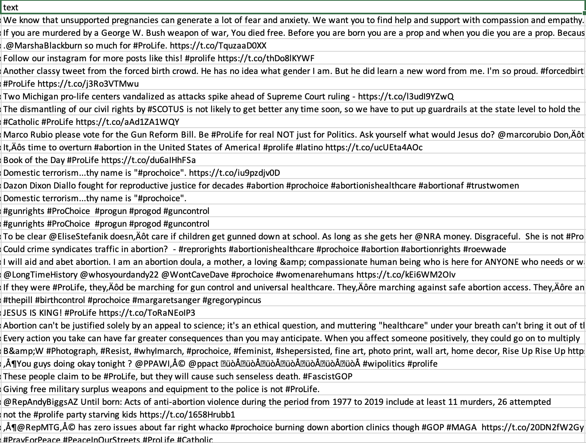
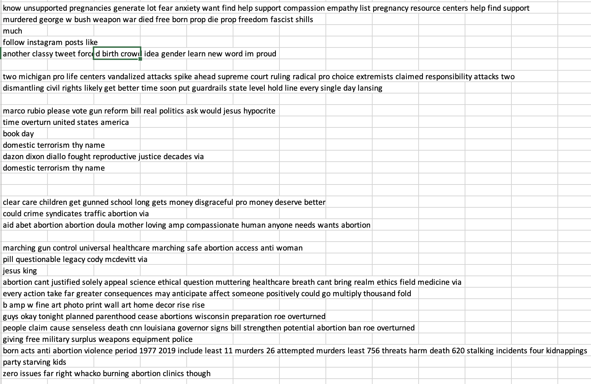

# 5922 Neural Nets Project

# MODULE 1

## INTRODUCTION

### Project Goal/Problem definition
-	This project will be focus on how to use neural networks to analyze the tweets about pro-choice VS pro-life due to the Roe vs. Wade cancellation sentence. 
-	The dataset gathers from Twitter and analyze the influence operations
-	The goal of this project is to filter out the dataset and provide a general view of Roe vs. Wade case, probably involving sentiment analysis. 
- Data visualization will be created to present for people who want to quickly understand the whole case
- The trained neural networks from this dataset will test some unlabeled tweets gathered from API

### Proposed Methodology
-	I plan to clean up the tweets and find the pattern of tweets based on the timeline of the event, provide a lot of time-series data visualization to help audience to know the general view
-	There will be a lot of misinformation bots in the Tweets, hopefully can identify them and filter them out
-	The word cloud will not be the only way to show the text features, try different plots to show text findings

### Five questions that I want to try to answer:
- How is people reaction changes between dates?
- How is the opinion related to location? 
- Can we use this neural nets to predict tweets (unlabeled) opinion?
- What is the frequency of tweets during the whole timeline?
- What are the words that contribute to pro-life/pro-choice?

## DATA GATHERING
Dataset of 56040 tweets collected in wake of the Roe vs. Wade cancellation sentence. 

The tweets are collected containing either the #prochoice or the #prolife hashtag, reflecting the two opposite poles of the discussion on the argument.

The tweets with #prochoice have target variable as 0, and the tweet with the #prolife have the target variable as 1.

I will use Twitter API to gather unlabeled tweets, the credential will not be viewable in Github. 

## DATA PREP
Please see the jupyter notebook for details.  

|             Original              |            Clean            |
|:---------------------------------:|:---------------------------:|
|  |  |

## DISCLAIMER
This dataset is not intended to be used to take a position on the discussion on the right to abortion. This dataset takes its cue from this discussion to create a corpus of tweets that can be tagged a priori.  

In this case, I am taking advantage of the fact that there are two hashtags that reflect the two opposite poles of opinions on the subject: pro-choice and pro-life respectively (indicated in this way only for alphabetical order, as well as labeled as 0 and 1 purely in order alphabetical).  

Rather, considerations can be made about the discussion itself, the differences in language and the methods of analyzing it.
