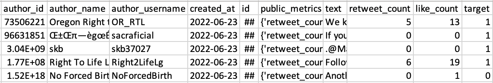
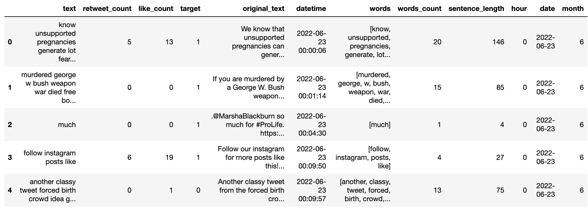

# Pro-Choice vs. Pro-Life: Tweets Exploratory Data Analysis

### To see a scientific format of paper, please see paper.docx

# Introduction
The 1973 Roe vs. Wade decision, legalizing abortion in all fifty states, seems to solve one of the most controversial issues in terms of abortion. However, on June 24, 2022, the Supreme Court issued a bill prohibiting women's access to out-of-state abortion services. Additionally, the Court banned abortions nationwide after 15 weeks of pregnancy, which overturned the Roe v. Wade case.  

The Congress's decision has drawn much attention on social media, especially from females. The argument divides into two opinions: Pro-Choice vs. Pro-Life. People who support pro-choice believe everyone has the fundamental human right to decide when and whether to have children. They think it is OK for them to have the ability to choose abortion as an option for an unplanned pregnancy – even if they would not choose abortion for themselves. The view is that a woman should have the legal right to an elective abortion, meaning the right to terminate her pregnancy.   

People who support pro-life believe that the life of the fertilized egg, embryo, or fetus is much more critical. They despise children's welfare after birth and oppose child welfare legislation. The controversial issues pit people against each other like they are on two teams. Most Americans believe abortion should be legal because it is the human right to access abortion.   

This paper will present an exploratory data analysis on tweets about pro-choice vs. pro-life. It is helpful for review for people who want to have a general idea about how people react to the bill that bans abortion in certain states, especially for females. The neural network model helps them to grasp a pragmatic understanding of the whole event timeline.   

More specifically, the model should provide a decent result so people can learn primary online users' opinions behind the case. In addition, this model should facilitate decision-makers in Congress to pass bills involving controversial issues because it generates local and global impacts at a certain level.   

  
Fig 1. Abortion-rights movements
# Data Gather
The dataset of 56,040 tweets was collected in the wake of the Roe vs. Wade cancellation sentence and analyzed the influence operations. The dataset is available to download from the Kaggle website, which lists in the reference.    

The tweets are collected containing either the #prochoice or the #prolife hashtag, reflecting the two opposite poles of the discussion. The tweets with #prochoice have a target variable of 0, and the tweet with the #prolife has a target variable of 1.  
        
  
Fig 2. Original dataset   

Other columns, such as 'created_at', 'retweet_count', and 'like_count', can be valuable features for the data model. On the other hand, the 'author_name', 'author_username', and other columns are irrelevant to this paper and will be omitted during the data preprocessing.  

In addition to the original dataset, newsapi.org provide API to gather unlabeled news titles related to Pro-Choice vs. Pro-Life. Registered a free account on newsapi.org to get the API key and set up an endpoint for the servers and the location on the server where data will be retrieved. The newspaper servers will query for all the topic names in the list: 'abortion' and 'antiabortion.'  

The server will respond in JSON format with the date, title, headline, and source. Then the JSON format transforms into a large CSV file where each article is in a row. Adding one column that either abortion or antiabortion to convert this data into a labeled data frame so model train and test with the data.  

  

Fig 3. Dataset retrieved from API
# Data Prep
Preprocessing is a crucial step in processing text, especially for tweets. Use standard text preprocessing techniques and tweets-specific preprocessing techniques to preprocess tweets. The standard preprocessing technique uses NLTK (Natural Language Tool Kit) library. The tweets-specific preprocessing technique uses Regular Expression (re in python library).  

The DateTime module transforms the ‘date’ column into ‘hour’ and ‘month.’ Moreover, use feature extracting to count words and sentence length to add more features to the dataset. Here is the list of tweets-specific preprocessing tasks using a regular expression:  
1.	Lowercasing all the letters
2.	Remove mentions ‘@.’
3.	Remove hashtags ‘#.’
4.	Remove links. Start with ‘HTTP’ or ‘www.’
5.	Remove punctuations
6.	Remove non-alphanumeric characters
7.	Remove stop words

  

Then, we tokenize and vectorize text with stemming. The goal is to reduce inflectional forms and sometimes derivationally related forms of a word to a common base form. Here, we remove all columns containing numbers and any column with a name of 3 or smaller, like ‘it,’ ‘of,’ and ‘pre.’  

After we tokenize the text, we encode it into a 500 numeric length array to represent the original text so the model can recognize them. We use the embedding (the matrix we made in the previous steps) to encode the text into an index inside the embedding. The padding method modifies that every encoded sentence will be the same length as 500. We append the ‘pad’ symbol if the length is less than 500 and get the first 500 tokens if the length is more significant than 500.  

We also split the dataset into train, valid, and test data with a ratio of 60, 20, and 20. The shape will be (33624,12), (11208,12), and (11208,12) corresponding. Using vocab to convert reviews (text) into numerical form, Replacing each word with its corresponding integer index value from the vocabulary. Assign the max length of the vocab + 1 to words, not in the vocab. For the dataset from news API, we do similar preprocessing like tweets, but we focus on the title and headline.  

# NN w/ BP Architecture and Design

Fig 8. Neural Net structure

Iteration 1000

Total Loss: 4840.214395017918

Average Loss: 0.12891424905497037

The confusion matrix is:

[[10232 8087]

[16 19211]]

The accuracy score is:

0.7841847333937038

Fig 9. Total loss

Fig 10. Average Loss

# Sample Execution

TBD 

# Conclusion

This dataset is not intended to be used to take a position on the discussion on the right to abortion. I focus on the ethical arguments and underlying issues rather than on political considerations that might also be involved. This dataset takes its cue from this discussion to create a corpus of tweets that can be tagged a priori.

I use neural networks intended to answer following questions:

1. How is people reaction changes between dates?

2. Can we use the neural net to predict tweets opinion?

3. What is the frequency of tweets during the whole timeline?

4. What are the words that contribute to pro-life/pro-choice

For now, the epoch is 1000 and learning rate 0.01 with sample size 37,546, we get 78% accuracy. Parameter tuning will be used during next tasks.

The network intended to predict the tweets is supporting pro-life or pro-choice, the input vector is retweet\_count, like\_count, words\_count, sentence\_length, and hour.

##### Acknowledgment

TBD

##### References

[1]

[2]

CSCI 5922-003 Neural Nets and Deep Learning ©2022