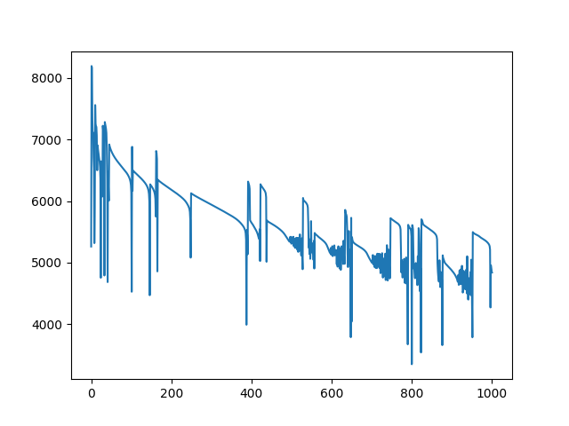

# Pro-Choice vs. Pro-Life: Tweets Exploratory Data Analysis

### To reproduce the result, please rerun the cells in jupyter notebook
### To see a scientific format of paper, please see paper.docx

# Introduction
The 1973 Roe vs. Wade decision, legalizing abortion in all fifty states, seems to solve one of the most controversial issues in terms of abortion. However, on June 24, 2022, the Supreme Court issued a bill prohibiting women's access to out-of-state abortion services. Additionally, the Court banned abortions nationwide after 15 weeks of pregnancy, which overturned the Roe v. Wade case.  

The Congress's decision has drawn much attention on social media, especially from females. The argument divides into two opinions: Pro-Choice vs. Pro-Life. People who support pro-choice believe everyone has the fundamental human right to decide when and whether to have children. They think it is OK for them to have the ability to choose abortion as an option for an unplanned pregnancy – even if they would not choose abortion for themselves. The view is that a woman should have the legal right to an elective abortion, meaning the right to terminate her pregnancy.   

People who support pro-life believe that the life of the fertilized egg, embryo, or fetus is much more critical. They despise children's welfare after birth and oppose child welfare legislation. The controversial issues pit people against each other like they are on two teams. Most Americans believe abortion should be legal because it is the human right to access abortion.   

This paper will present an exploratory data analysis on tweets about pro-choice vs. pro-life. It is helpful for review for people who want to have a general idea about how people react to the bill that bans abortion in certain states, especially for females. The neural network model helps them to grasp a pragmatic understanding of the whole event timeline.   

More specifically, the model should provide a decent result so people can learn primary online users' opinions behind the case. In addition, this model should facilitate decision-makers in Congress to pass bills involving controversial issues because it generates local and global impacts at a certain level.   

Fig 1. Abortion-rights movements

# Data Gather and Prep

This paper is not focus on text preprocessing (Natural language programming) but focus on neural network, so I include essential steps about text preprocessing instead of detailed step-by-step explanation.

Fig 2. Original dataset, contain raw tweets and other features

The dataset of 56,040 tweets collected in wake of the Roe vs. Wade cancellation sentence and analyze the influence operations. The tweets are collected containing either the #prochoice or the #prolife hashtag, reflecting the two opposite poles of the discussion on the argument.

The tweets with #prochoice have target variable as 0, and the tweet with the #prolife have the target variable as 1. I would use Twitter API to gather unlabeled tweets but here is not reveal any credential and code during current stage.

Fig 3. Preprocess Datetime using strptime library.

I use datetime module to fix the formatting of the date column. I will also be using regular expressions to fix the structure of the text and remove unnecessary ascii symbols because tweets can contain a lot of things such as mentions, hashtags, links, punctuations, and etc. Here is the list of text preprocessing tasks:

1. Lowercasing all the letters
2. Remove mentions '@'
3. Remove hash tags '#'
4. Remove URLs, start with 'http' or 'www'
5. Remove punctuations
6. Remove non-alphanumeric characters
7. Remove stop words

Fig 4. Preprocess tweets based on tasks

Fig 5. Preprocess text into numerical values

Fig 6. Train set

Fig 7. Test set

# NN w/ BP Architecture and Design

Fig 8. Neural Net structure

Iteration 1000

Total Loss: 4840.214395017918

Average Loss: 0.12891424905497037

The confusion matrix is:

[[10232 8087]

[16 19211]]

The accuracy score is:

0.7841847333937038

Fig 9. Total loss

Fig 10. Average Loss

# Sample Execution

TBD 

# Conclusion

This dataset is not intended to be used to take a position on the discussion on the right to abortion. I focus on the ethical arguments and underlying issues rather than on political considerations that might also be involved. This dataset takes its cue from this discussion to create a corpus of tweets that can be tagged a priori.

I use neural networks intended to answer following questions:

1. How is people reaction changes between dates?

2. Can we use the neural net to predict tweets opinion?

3. What is the frequency of tweets during the whole timeline?

4. What are the words that contribute to pro-life/pro-choice

For now, the epoch is 1000 and learning rate 0.01 with sample size 37,546, we get 78% accuracy. Parameter tuning will be used during next tasks.

The network intended to predict the tweets is supporting pro-life or pro-choice, the input vector is retweet\_count, like\_count, words\_count, sentence\_length, and hour.

##### Acknowledgment

TBD

##### References

[1]

[2]

CSCI 5922-003 Neural Nets and Deep Learning ©2022